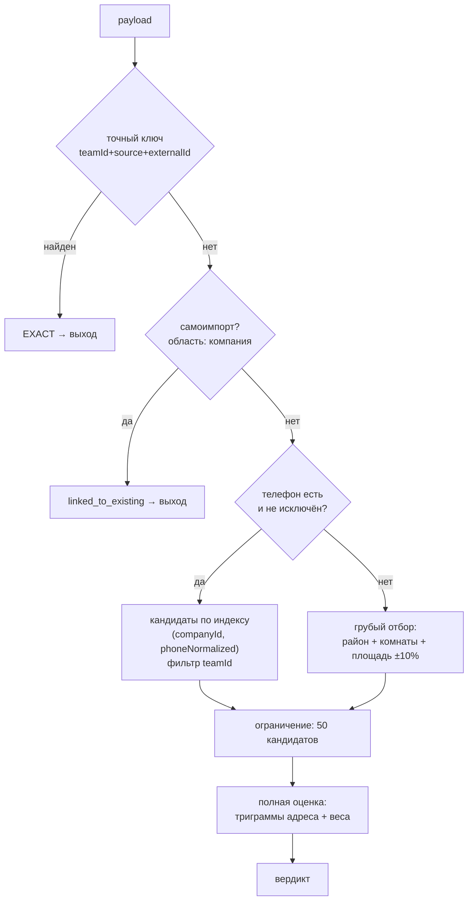

# Дедупликация

**Дата:** 2026-08-31. **Фаза:** 1, проектная часть. Калибровка — фаза 4, проверка на реальных данных — фазы 5–6.
**Основание:** промпт v2.2 раздел 5, инвариант 9; дефолты Q6, Q7, Q8, Q23, Q31, Q43; риски R-03, R-06, R-10.

Центральная функция продукта. Владелец сказал прямо: **проверять только один параметр нельзя** (S§4.14).

---

## 1. Пять проверок, пять областей

Под словом «дедупликация» живут разные проверки с разными целями. Переносить их на одну область нельзя — инвариант 9. Это самое опасное место всей системы: ошибка «заменить компанию на команду везде» ломает защиту от самоимпорта и отравляет базу (R-31).

| Проверка | Область | Поведение |
|---|---|---|
| Дубль при «Согласен» — создание объекта | **Команда** | `EXACT` блокирует, `STRONG` предупреждает |
| Тот же объект ведёт другая команда | Компания | Мягкая пометка, **никогда** не блокирует |
| Своё же объявление вернулось (самоимпорт) | **Компания** | Всегда привязка, никогда новый объект |
| Объект уже размещён на площадке | **Компания** | Предупреждение до заполнения формы |
| Изоляция арендаторов | **Компания, жёстко** | Не пересекается ни при какой проверке |

Формула, которую нельзя нарушать:

> Конкурировать команды могут за собственника. Публиковать одну квартиру дважды от имени одного агентства они не должны.

---

## 2. Четыре уровня

Уровни 1–3 — детерминированные правила, они задают вердикт напрямую. Уровень 4 — вероятностная оценка, она работает, когда правила не сработали.

**Итоговый вердикт = наибольший из двух**: полученного правилом и полученного по баллу. Такое устройство выбрано сознательно: правило «телефон + адрес → `STRONG`» из промпта не всегда достижимо суммой весов, и подгонять веса под это правило означало бы раздуть вес адреса — свободного текста без гарантии формата.

### Уровень 1 — точное совпадение

`source + externalId` в области команды, либо канонический URL, если `externalId` отсутствует.

```
(teamId, source, externalId)    → EXACT
(teamId, source, canonicalUrl)  → EXACT   // когда externalId нет
```

Тот же ключ служит ключом идемпотентности повторного импорта (Q43, перекрывает Q21 по области).

**Канонизация URL обязательна и делается до сравнения:** нижний регистр хоста, отбрасывание `utm_*`, `fbclid`, якорей и завершающего слэша, сортировка оставшихся параметров. Без неё одно и то же объявление, открытое из поиска и из закладки, даст два разных ключа.

`externalId` может отсутствовать у площадки в принципе (R-08). Уровень 1 тогда деградирует до URL, а URL меняется чаще. Поэтому уровни 2–4 обязаны работать независимо от наличия внешнего идентификатора — это требование к реализации, а не пожелание.

### Уровень 2 — телефон

Нормализованный номер собственника совпал с номером у объекта команды → кандидат, вердикт **не ниже `POSSIBLE`**.

Сам по себе телефон `STRONG` не даёт: у одного собственника бывает несколько квартир, и это норма, а не аномалия.

### Уровень 3 — телефон плюс параметры

Телефон **и** (адрес **или** (площадь **и** комнаты)) → **`STRONG`**, детерминированно.

### Уровень 4 — вероятностная оценка

Работает всегда, в том числе когда телефона нет. Балл считается по таблице весов §3.

---

## 3. Веса и пороги

**Живут в конфиге, отдельно от логики** — требование C18. Файл: `packages/core/config/duplicate-detection.json`. Ни одно значение отсюда не появляется в коде литералом.

### Веса признаков

| Признак | Вес | Совпадением считается |
|---|---|---|
| `ownerPhone` | **0.50** | Равенство нормализованных номеров в E.164 |
| `address` | 0.20 | Триграммное сходство `addressNormalized` ≥ 0.60 |
| `area` | 0.20 | Разница ≤ 2% либо ≤ 1 м² — что больше |
| `rooms` | 0.16 | Точное равенство |
| `photos` | 0.12 | Совпал хотя бы один URL фотографии |
| `price` | 0.05 | Разница ≤ 5% |
| `floor` | 0.04 | Точное равенство |
| `propertyType` | 0.03 | Равенство после приведения к словарю CRM |
| `totalFloors` | 0.02 | Точное равенство |

`score = min(1.0, Σ весов совпавших признаков)`

**Признак, отсутствующий хотя бы у одной из сторон, не участвует ни в сумме, ни против неё.** Отсутствие данных — не доказательство различия. Число сравнимых признаков возвращается в ответе: два совпавших признака из двух сравнимых и два из девяти — разные ситуации, и агент должен видеть разницу.

**Ограничение против ложных `STRONG` на бедных данных:** если сравнимых признаков меньше трёх, вердикт по баллу не поднимается выше `POSSIBLE`, каким бы ни была сумма.

### Почему веса именно такие

**Телефон — половина шкалы**, потому что владелец назвал его первым признаком (S§4.14) и спецификация строит на нём уровни 2 и 3. Это единственный признак, который на рынке объявлений почти уникален.

**Схема весов из архивного документа не применяется** (C-03). Там 25% адрес + 25% координаты — половина шкалы на данных, которых у нас нет: координат в payload нет вообще (S§27), а геокодирования в MVP нет. Телефон в той схеме отсутствовал как признак.

**Фотографии оцениваются по совпадению URL, а не изображения.** Совпавший URL означает буквально тот же файл на площадке — сильный признак почти без затрат. Сравнения самих изображений в MVP нет.

**Адрес — свободный текст без гарантии формата.** Вес 0.20 отражает это: он заметный, но не решающий. Триграммное сравнение через `pg_trgm`, порог 0.60 — стартовое значение, калибруется.

### Пороги (Q7)

| Балл | Вердикт |
|---|---|
| ≥ 0.80 | `STRONG` |
| 0.50 – 0.79 | `POSSIBLE` |
| < 0.50 | `NONE`, совпадение не показывается |

Это стартовые значения, а не выведенные из данных (R-03). Ошибка опасна в обе стороны: слишком строго — агент видит предупреждение на каждый второй импорт и перестаёт их читать; слишком мягко — база наполняется дублями, от которых продукт должен защищать.

**Ранний индикатор перекоса** — доля предупреждений, закрытых через «Добавить всё равно». Высокая доля означает, что система слишком строгая, и это разговор с владельцем, а не тихая правка порога.

### Проверка совпадений с примером из промпта

| Случай | Балл | Вердикт | Откуда |
|---|---|---|---|
| Телефон | 0.50 | `POSSIBLE` | Уровень 2 |
| Телефон + площадь + комнаты | 0.86 | `STRONG` | Балл и уровень 3 согласованы |
| Телефон + адрес | 0.70 | `STRONG` | Правило уровня 3 перекрывает балл |
| Все параметры без телефона | 0.82 | `STRONG` | Уровень 4 |
| Площадь + комнаты, больше ничего сравнимого | 0.36 | `NONE` | Ниже порога |

Пример контракта из промпта §5.3 (телефон 0.50 + площадь 0.20 + комнаты 0.16 = 0.86) воспроизводится этой таблицей точно.

---

## 4. Исходы

| `result` | Когда | Действия агенту |
|---|---|---|
| `created` | `NONE` | Тихое создание |
| `duplicate_blocked` | `EXACT`, тот же источник | Открыть существующий. Второй копии не будет |
| `linked_to_existing` | `STRONG` с **другого** источника; самоимпорт | Открыть объект. Новый `SourceListing` привязан |
| `duplicate_warning` | `STRONG` с того же источника | Открыть существующий / Отменить / Добавить всё равно |
| `created` + `matches` | `POSSIBLE` | Импорт прошёл, совпадение показано мягкой пометкой |
| `observation_recorded` | Исход не `consent` | Объект не создан, объявление помечено |

**`linked_to_existing` — четвёртый исход, добавленный к контракту промпта** (Q23, C-04). Без него расширение не может отличить «этот объект у тебя уже есть, ты ничего не добавил» от «объявление с myhome привязано к твоему объекту, пришедшему с ss». Второе — полезный результат: агент узнал, что квартира рекламируется на двух площадках. Показывать оба случая одним сообщением значит терять информацию.

**Уточнение фазы 4: `linked_to_existing` срабатывает на `STRONG`, а не на `EXACT`.** Уровень 1 включает источник в ключ, поэтому `EXACT` с другой площадки недостижим в принципе — тот же объект оттуда опознаётся уровнем 3. Привязка выбрана вместо предупреждения именно потому, что это и есть случай, ради которого Q23 добавил четвёртый исход: полезный результат, а не дубль.

**Система не агрессивна.** Агент может настоять на своём везде, кроме `EXACT`, где вторая копия бессмысленна. Это относится и к привязке: повтор с `acknowledgedDuplicateOf` создаёт отдельный объект — на случай, если совпадение оказалось ложным.

**При `POSSIBLE` импорт проходит** (P§5.2): совпадение возвращается вместе с созданным объектом как мягкая пометка после факта, а не как блокировка до него.

**Автоматического слияния нет** (Q8). Ошибочный merge необратим и портит базу молча — в MVP только ручная привязка объявления к существующему объекту.

### Контракт ответа

```jsonc
{
  "result": "created" | "duplicate_blocked" | "duplicate_warning" | "linked_to_existing",
  "verdict": "EXACT" | "STRONG" | "POSSIBLE" | "NONE",
  "property": { "id": "...", "title": "...", "address": "..." },
  "matches": [
    {
      "propertyId": "...",
      "score": 0.86,
      "comparableFields": 7,
      "matchedFields": 3,
      "scope": "team" | "company",
      "reasons": [
        { "field": "ownerPhone", "weight": 0.50, "detail": "совпадает номер собственника" },
        { "field": "area",       "weight": 0.20, "detail": "78 м² ≈ 78 м²" },
        { "field": "rooms",      "weight": 0.16, "detail": "3 = 3" }
      ],
      "reasonHuman": "Совпадает номер собственника и параметры объекта",
      "preview": { }
    }
  ],
  "actions": ["open_existing", "cancel", "import_anyway"]
}
```

**`reasonHuman` обязателен.** Агент должен понимать причину без объяснений разработчика. Балл без объяснения — чёрный ящик, который перестают читать через неделю.

**`scope` в каждом совпадении** показывает, откуда оно: из своей команды или из другой команды компании. От этого зависит и набор действий, и состав предпросмотра.

### Предпросмотр объекта другой команды

Урезанный набор (Q40, J23, C-06):

| Показывается | Не показывается |
|---|---|
| Адрес, площадь, комнаты, этаж | **Телефон собственника** |
| Статус в воронке | **Описание объекта** |
| Ответственный агент и его команда | Историю действий |
| Дата создания | |

Агент понимает «объект ведёт команда B, ответственный — Нино», но чужого контакта не получает. Совпадение из другой команды **никогда не блокирует создание** — конкуренция между командами разрешена владельцем.

---

## 5. Поиск кандидатов

Скорость импорта — главный приоритет продукта. Синхронная дедупликация не имеет права замедляться по мере роста базы (R-10), поэтому порядок этапов зафиксирован здесь, а не отдан на усмотрение реализации.



**Сначала дешёвые точные признаки, тяжёлая оценка — только на суженном наборе.** Обратный порядок даёт линейный рост времени импорта, и главный KPI продукта деградирует незаметно.

**Ограничение в 50 кандидатов** защищает от патологического случая: телефон агентства, под которым висит триста объявлений. Порог в конфиге. Если ограничение сработало, это записывается в метрику — регулярное срабатывание означает, что фильтр исключения агентских номеров работает плохо.

**Время ответа `POST /import/listing` замеряется с фазы 4**, а не «когда станет медленно».

---

## 6. Петля «своё объявление вернулось обратно»

Опубликованное нами объявление живёт на площадке. Через день его импортирует агент — свой или из соседней команды. Без защиты это даёт второй `Property` на тот же объект с телефоном **агентства** в поле контакта собственника. Один такой объект отравляет дедупликацию всей команды: под этим номером у неё окажутся все объекты агентства.

**Все четыре проверки — область компании**, а не команды. Это прямо оговорено в промпте §5.5 и в инварианте 9.

### 6.1. Совпадение с записью публикации

`source + externalId` импортируемого объявления сравнивается с `Publication` компании. Совпало — новый объект не создаётся, `SourceListing` привязывается к исходному `Property`, агенту показывается: «Это объявление разместило ваше агентство».

### 6.2. Запасные признаки, когда подтверждения не было

Проверка 6.1 опирается на `externalId`, который появляется только после подтверждения публикации агентом. Агент может его не нажать — и защита не сработает ровно тогда, когда нужна: объявление реально живёт на площадке (C-19, P5).

Поэтому проверка не опирается на один ключ (Q31):

1. `canonicalUrl` импорта сравнивается с `Publication.externalUrl` у записей в статусе `filled`;
2. телефон объявления сравнивается с `phoneNormalized` профилей публикации компании.

**Второй признак работает даже без подтверждения.** Если в объявлении наш собственный контактный номер, это почти наверняка наша публикация.

### 6.3. Телефоны профилей исключены из уровней 2 и 3

Иначе все объекты агентства станут дублями друг друга: у них один контактный номер.

**Область — компания, не команда.** Иначе команда B не узнает о профиле команды A и получит ложные совпадения по номеру собственного агентства.

### 6.4. Телефон у 5 и более объектов теряет вес

Такой номер принадлежит агентству или другому риелтору, а не собственнику. Признак опускается на уровень 4: он перестаёт давать `POSSIBLE` сам по себе, но остаётся слабым сигналом.

**Считается по компании даже при командной дедупликации.** Команда, у которой всего десяток объектов, сама по себе такой номер не распознает.

Порог 5 — в конфиге.

### 6.5. Обратная проверка при размещении

Если у объекта уже есть `SourceListing` на этой площадке — в том числе то самое объявление, из которого объект был импортирован, — агенту показывается предупреждение **до заполнения формы**: «Открыть существующее / Разместить всё равно / Отмена» (I22, P9).

---

## 7. Нормализация

Самое вероятное место тихой поломки: всё выглядит работающим, а уровни 2–3 не срабатывают (R-06).

**Телефон.** Хранятся оба вида: оригинал как на странице и E.164 (Q18). Поддержка `+995` и локальных записей; окончательный набор форматов составляется **по фикстурам фазы 5**, потому что как именно номер выглядит на странице, сейчас неизвестно. Юнит-тесты на наборе форматов из фикстур обязательны.

**Адрес.** Нижний регистр, схлопывание пробелов, единообразие сокращений («ул.», «улица»), удаление пунктуации. Результат в `addressNormalized`, по нему построен GIN-индекс с `gin_trgm_ops`.

**Площадь.** Дробная часть до одного знака, единица измерения приводится к м².

**Тип и назначение.** Словарь площадка → значение CRM. Составляется по фикстурам, до них не заполняется ни одной строкой (правило R2).

---

## 8. Калибровка

Требование C19: любое изменение весов прогоняется по размеченному набору, точность и полнота фиксируются **в этом файле**.

### Размеченный набор

Собирается в фазе 4 из фикстур и синтетических случаев. Обязательные категории:

- одна квартира на двух площадках, один собственник;
- две разные квартиры одного собственника — **должно быть `POSSIBLE`, не `STRONG`**;
- объявление агентства с номером, повторяющимся у многих объектов;
- своё объявление, вернувшееся обратно, — с подтверждением публикации и без него;
- объявление без телефона;
- объявление без `externalId`;
- один и тот же объект у двух команд компании — **должна быть мягкая пометка, не блокировка**.

### Результаты

| Дата | Версия конфига | Точность | Полнота | Комментарий |
|---|---|---|---|---|
| 2026-08-31 | стартовая | — | — | Реализовано и покрыто тестами. Цифр по-прежнему нет: набор синтетический, а точность и полнота на выдуманных примерах ничего не измеряют |

Таблица заполняется при каждом изменении весов. Пустая клетка честнее придуманной цифры.

**Что уже проверено (фаза 4), и что это не заменяет.** Тестами закрыты все категории размеченного набора из списка выше — на синтетических данных. Это доказывает, что механизм работает как задумано: пять примеров из §3 воспроизводятся до сотых, области проверок разведены, телефон профиля исключается, неполные данные не роняют импорт.

Чего это НЕ доказывает: что пороги 0.80 и 0.50 верны. Их верность проверяется только на реальных объявлениях, а фикстуры фазы 5 ещё не собраны. До тех пор цифры точности и полноты остаются пустыми — измерять их на примерах, которые я сам придумал под свои же веса, значит измерять собственную последовательность, а не качество дедупликации.

---

## 9. Что известно и что предполагается

| Утверждение | Уровень |
|---|---|
| Проверять один параметр нельзя | `CONFIRMED` — S§4.14 |
| Четыре уровня, вердикт с причинами | `CONFIRMED` — P§5.1 |
| Область создания объекта — команда, остальные проверки — компания | `CONFIRMED` — решение владельца 2026-08-31 |
| Автослияния нет | `CONFIRMED` — Q8 |
| Пороги 0.80 / 0.50 | `DERIVED`, дефолт Q7. Калибруются |
| Конкретные веса признаков | `RECOMMENDED`. Спроектированы от полей, реально существующих в payload |
| Триграммный порог адреса 0.60 | `RECOMMENDED`. Стартовое значение |
| Ограничение 50 кандидатов, порог 5 объектов на телефон | `RECOMMENDED`. Конфиг |
| Форматы телефонов Грузии | `OPEN` — Q18, ждёт фикстур |
| Наличие и стабильность `externalId` | `OPEN` — R-08, ждёт фикстур |
