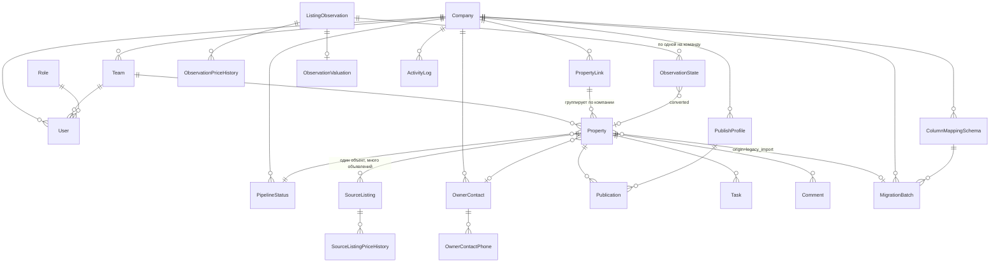

# Модель данных

**Дата:** 2026-08-31. **Фаза:** 1. **Статус:** проектная, до первой миграции.
**Основание:** промпт v2.2 разделы 4, 5, 5Б, 6А, 6В, 6Г; `requirements-matrix.md`; дефолты от 2026-08-31.

Каждая сущность ниже сопровождена ответом на вопрос «зачем она отдельная». Сущность без такого ответа в схему не попадает.

---

## 1. Карта



`ListingObservation` намеренно не связан с `Company`. Это не упущение — это инвариант 16, и ниже объяснено, почему.

---

## 2. Главное разделение: `Property` ≠ `SourceListing`

Инвариант 5. Единственное решение схемы, от которого зависит всё остальное, поэтому оно объяснено первым и подробно.

**`Property`** — физическая квартира в Тбилиси. Она существует независимо от того, рекламируется ли она сейчас хоть где-нибудь.
**`SourceListing`** — объявление об этой квартире на конкретной площадке. У одной квартиры их может быть несколько.

### Что даёт это разделение

**Дедупликация становится возможной вообще.** Собственник размещает одну и ту же квартиру на ss.ge и на myhome.ge — это норма рынка, а не исключение. Без разделения агент импортирует её дважды и получает два объекта, у которых отличается только `url`. С разделением второй импорт находит существующий `Property` и привязывает к нему второй `SourceListing`. Именно это и есть исход `linked_to_existing` (Q23): работа выполнена, дубля не создано.

**Цена перестаёт быть одним числом.** Цена живёт на объявлении, а не на объекте: на двух площадках она может отличаться, и это ценная информация, а не ошибка данных. У `Property` при этом своя цена — та, с которой агентство работает.

**Петля самоимпорта закрывается.** Агентство публикует свой объект, объявление живёт на площадке, через месяц другой агент той же компании находит его и импортирует. Без разделения появляется второй объект с телефоном собственного агентства в поле «контакт собственника» — и он отравляет дедупликацию всей команды (R-31). С разделением объявление привязывается к исходному `Property` (I19).

**Исчезновение объявления не означает продажи квартиры.** Объявление снято — у `SourceListing` меняется `lifecycle`. Объект в воронке при этом не двигается: решение о том, продана квартира или собственник просто снял рекламу, принимает человек.

### Чего это стоит

Каждый запрос «покажи объекты с ценой» становится join. При масштабе Q27 (~200 000 объектов) это несущественно, но требует индексов, перечисленных в §9.

---

## 3. Компания, команды, доступ

| Сущность | Поля | Зачем отдельная |
|---|---|---|
| `Company` | `id`, `name`, `createdAt` | Граница арендатора. Жёсткая, инвариант 9 |
| `Team` | `id`, `companyId`, `name`, `createdAt` | Область дедупликации и видимости после решения владельца от 2026-08-31 (Q22, J19). До версии 2.2 команда была организационной единицей, теперь она ещё и граница проверки на дубли |
| `Role` | `id`, `code`, `name` | Таблица-справочник из трёх строк, создаётся сидом: `ADMIN`, `MANAGER`, `AGENT`. Отдельная сущность, а не перечисление, — по C-09 и Q28: кастомных ролей в MVP нет, но схема готова к ним без миграции живой базы |
| `User` | `id`, `companyId`, `teamId?`, `roleId`, `email`, `passwordHash`, `fullName`, `isActive`, `tokenVersion`, `createdAt`, `lastLoginAt` | — |

**Поправка фазы 3: членство вынесено в `TeamMember`.** Здесь стояло поле `User.teamId`. Промпт §3.Ф3 перечисляет `TeamMember` отдельной сущностью, и промпт старше этого документа — реализована таблица.

| Сущность | Поля | Зачем отдельная |
|---|---|---|
| `TeamMember` | `id`, `companyId`, `teamId`, `userId`, `createdAt` | Промпт §3.Ф3. Плюс перевод пользователя между командами становится записью, а не затиранием поля |
| `RefreshToken` | `id`, `userId`, `tokenHash`, `expiresAt`, `revokedAt?`, `replacedById?` | Ротация по `ADR-0003`. Хранится хеш, а не токен: утечка базы не должна давать доступ к живым сессиям |

**В MVP действует ограничение «одна команда на пользователя»** — уникальный индекс по `userId`. Не потому, что так проще: область дедупликации — команда (`ADR-0006`), и при двух командах у одного агента непонятно, чья команда владеет созданным объектом. Ограничение снимается изменением одного индекса, когда владелец решит иначе; отдельную таблицу в живую базу добавлять было бы дороже.

**Команда обязательна для `AGENT` и `MANAGER`, необязательна для `ADMIN`.** Проверяется в сценарии, а не схемой: CHECK-условие завязано на `roleId` и при добавлении ролей превратится в мину.

**`RefreshToken.replacedById`** хранит цепочку ротации. Повторное использование отозванного токена — признак кражи, и по цепочке видно, что произошло.

**`tokenVersion`** — счётчик для отзыва refresh-токенов. Увеличивается при смене пароля и при отключении пользователя. Подробности в `ADR-0003-auth.md`.

**`companyId` продублирован почти везде**, хотя во многих случаях выводится через `teamId`. Это сознательная денормализация ради правила 5: любой запрос на чтение фильтруется по `companyId` напрямую, без join к `Team`. Забытый join — это утечка между арендаторами (R-04); забытый `where companyId` виден в коде глазами.

---

## 4. Ядро: объект, объявление, контакт

### `Property`

| Поле | Тип | Комментарий |
|---|---|---|
| `id` | uuid | |
| `companyId`, `teamId` | fk | Владение — команда (Q33). `companyId` денормализован |
| `assignedUserId` | fk | Ответственный агент |
| `propertyLinkId` | fk? | Связка записей об одной квартире у разных команд, §5 |
| `pipelineStatusId` | fk | Инвариант 4: статусы не захардкожены |
| `origin` | enum | `consent` \| `manual` \| `legacy_import`. **Обязательное** (J15, инвариант 14) |
| `originAt` | timestamp | Когда объект вошёл в базу |
| `migrationBatchId` | fk? | Заполнено только при `origin = legacy_import`, нужно для отката (L9) |
| `ownerContactId` | fk? | |
| `transactionType` | enum | `SALE` \| `RENT` |
| `propertyType` | enum | `APARTMENT` \| `HOUSE` \| `LAND` \| `COMMERCIAL` |
| `rooms`, `areaTotal`, `floor`, `totalFloors` | int / numeric | Признаки дедупликации 3–4 уровня |
| `district`, `addressRaw`, `addressNormalized` | text | `addressRaw` — как на площадке; `addressNormalized` — приведённый вид для сравнения |
| `price`, `currency` | numeric, char(3) | Q13: как есть, без конвертации |
| `descriptionSource` | text? | Описание из объявления |
| `publicDescription` | text? | Текст для публикации, редактируется в CRM (I24, P1) |
| `createdByUserId`, `createdAt`, `updatedAt` | | |

**Почему `origin` обязателен, а не выводится.** Правило R14 разрешает ровно два исключения из «объект только по согласию», и оба обязаны быть видимы. Если поле необязательное, через год половина базы будет с `null`, и никто не скажет, был ли по этому объекту разговор с собственником. Значение отображается в карточке (J16, L12).

**Почему `publicDescription` отдельно от `descriptionSource`.** Описание из чужого объявления — чужой текст. Публиковать его от имени агентства странно юридически и стилистически (P1). Плюс правило R12: `publicDescription` очищается от телефонов перед отправкой в черновик публикации, а `descriptionSource` не трогается.

**Почему `addressNormalized` отдельным полем, а не вычисляется на лету.** Дедупликация 4 уровня сравнивает адреса триграммами. Индекс `gin_trgm_ops` можно построить только по хранимой колонке.

### `SourceListing`

| Поле | Тип | Комментарий |
|---|---|---|
| `id` | uuid | |
| `propertyId` | fk | |
| `companyId`, `teamId` | fk | Денормализация ради уникальных индексов идемпотентности |
| `source` | enum | `SS_GE` \| `MYHOME_GE` |
| `externalId` | text? | **Может отсутствовать** — риск R-08 |
| `canonicalUrl` | text | Запасной ключ, когда `externalId` нет |
| `originalUrl` | text | Как агент открыл страницу, со всеми метками |
| `price`, `currency` | | Цена **этого объявления**, не объекта |
| `lifecycle` | enum | `active` \| `stale` \| `removed`. Меняет человек, не фоновый опрос (Q32) |
| `firstSeenAt`, `lastSeenAt` | timestamp | |
| `parserVersion` | text | Инвариант 6: версия чтения, отдельная от `formVersion` |
| `missingFields` | jsonb | Что адаптер не смог извлечь (D9) |
| `importedByUserId`, `importedAt` | | |

**Ключ идемпотентности — на команде, не на компании** (Q43, перекрывает Q21):

```sql
unique (teamId, source, externalId)   where externalId is not null
unique (teamId, source, canonicalUrl) where externalId is null
```

Два частичных уникальных индекса вместо одного составного — потому что `null` в Postgres не конфликтует сам с собой, и обычный уникальный индекс по `externalId` пропустил бы сколько угодно дублей с пустым идентификатором.

**`firstSeenAt` / `lastSeenAt`** взяты из архивного документа (`contradictions.md`, «Что стоит забрать», п. 1). Два поля почти нулевой стоимости, дающие ответ на вопрос «живо ли объявление» без всякого скрапинга.

### `SourceListingPriceHistory`

`RECOMMENDED`. `id`, `sourceListingId`, `price`, `currency`, `changedAt`.

При повторном импорте цена уже сравнивается (Q21) — записать изменение стоит одну вставку. Даёт агенту аргумент в разговоре с собственником: «вы снижали цену дважды за два месяца». Пункт 3 из «что стоит забрать»; тот же документ советует добавить его **до** первой миграции, потому что в живой базе история задним числом не появится.

### `OwnerContact` и `OwnerContactPhone`

| `OwnerContact` | `id`, `companyId`, `fullName?`, `createdAt` |
|---|---|
| `OwnerContactPhone` | `id`, `ownerContactId`, `companyId`, `phoneOriginal`, `phoneNormalized`, `isPrimary`, `createdAt` |

**Почему телефоны вынесены в отдельную таблицу.** В объявлении регулярно два номера. Телефон — ключ дедупликации уровней 2 и 3, то есть по нему идёт поиск, а не только показ. Хранить второй номер в поле `phone2` означает либо искать по двум колонкам, либо потерять признак. Отдельная таблица даёт один индекс `(companyId, phoneNormalized)` и одинаковую логику для любого числа номеров.

**Два поля на номер — обязательны** (Q18): `phoneOriginal` как на странице, `phoneNormalized` в E.164. Нормализация — самое вероятное место тихой поломки дедупликации (R-06), и без оригинала разобраться в ней будет невозможно.

**PII.** Правило 10: `phoneOriginal`, `phoneNormalized` и `fullName` не попадают в логи, в события об ошибках парсинга и в фикстуры в исходном виде. В `ActivityLog` вместо номера пишется маска.

### `PropertyLink`

`id`, `companyId`, `createdAt`.

Пустая на вид сущность с одной задачей: **связать записи об одной физической квартире, заведённые разными командами** (Q33, J20–J21).

После перевода дедупликации на область команды две команды одного агентства могут легально вести одну квартиру. Компании при этом нужно знать, что это одна квартира, — иначе не работают три вещи: защита от самоимпорта (I19), предупреждение «объект уже размещён на этой площадке» (I22) и отчётность администратора.

**Связка не даёт прав.** Агент команды B по-прежнему не видит объект команды A; он видит только мягкую пометку «этот объект ведёт команда A, ответственный — Нино» без телефона и описания (Q40, J23). Смешать группировку с доступом — прямой путь к нарушению правила 6.

---

## 5. Воронка и журнал

### `PipelineStatus`

`id`, `companyId`, `code`, `name`, `sortOrder`, `isSystem`, `colorToken`. Уникальность `(companyId, code)`.

Инвариант 4. Сид создаёт на компанию **пять** статусов (J10, J10a, §5Б.4):

| `code` | Название | Уровень | `isSystem` |
|---|---|---|---|
| `IN_BASE` | В базе | CONFIRMED | да |
| `IN_PROGRESS` | Принято в работу | CONFIRMED | да |
| `OFFERED` | Предложен клиенту | RECOMMENDED | нет |
| `CLOSED` | Закрыт | RECOMMENDED | нет |
| `ARCHIVED` | Архив | RECOMMENDED | нет |

Не девять и не десять: черновой набор из `S§10` **отменён версией 2.2** (Q4, Q17). Первые шесть его стадий описывают период, когда объекта ещё нет, и переехали в `ObservationState`. `isSystem` защищает два статуса от удаления — на них завязаны переходы, а не только отображение.

### `ActivityLog`

`id`, `companyId`, `teamId?`, `userId?`, `entityType`, `entityId`, `action`, `before jsonb?`, `after jsonb?`, `createdAt`.

Инвариант 7, пишется с первого дня. `before` / `after` — по Q30 и пункту 5 из «что стоит забрать»: два поля в схеме, без которых будущая аналитика неполна, а добавить их в живую базу агентства дороже.

**Заполняются не всегда, а для смены статуса и переназначения агента.** Писать снимок объекта на каждое действие — это способ получить таблицу, которая через год будет больше всей остальной базы.

**PII в `before` / `after` запрещена.** Смена телефона собственника пишется как факт изменения с маской, а не со значением.

### `Task`, `Comment`

`Task`: `id`, `companyId`, `teamId`, `propertyId?`, `assignedUserId`, `title`, `dueAt`, `isDone`, `createdByUserId`, `createdAt`.
`Comment`: `id`, `companyId`, `propertyId`, `userId`, `body`, `createdAt`.

Из спецификации. `Task.propertyId` допускает `null`: у агента бывают задачи, не привязанные к объекту.

---

## 6. Публикация

### `PublishProfile`

`id`, `companyId`, `userId?`, `displayName`, `phoneOriginal`, `phoneNormalized`, `isDefault`, `createdAt`.

Лицо агентства в публичном объявлении (I13). `userId` заполнен — персональный профиль агента, пуст — общий профиль компании.

**`phoneNormalized` здесь нужен не для показа, а для защиты.** Он участвует в двух проверках уровня компании: телефоны профилей исключаются из дедупликации по телефону (I20) и служат признаком самоимпорта, когда агент не подтвердил публикацию (Q31, C-19). Без нормализованного вида сравнение с телефоном объявления не сработает.

### `Publication`

| Поле | Комментарий |
|---|---|
| `id`, `companyId`, `teamId`, `propertyId`, `publishProfileId` | |
| `source` | Площадка |
| `status` | `draft` \| `filled` \| `published` \| `expired` |
| `formVersion` | Версия заполнения, **отдельная от `parserVersion`** (I9, инвариант 6) |
| `externalId?`, `externalUrl?` | Появляются только после подтверждения |
| `filledAt`, `publishedAt?`, `confirmedByUserId?` | |
| `unfilledFields` | jsonb: что не заполнилось и почему (`no_value`, `no_mapping`, `field_not_found`, `manual_only`) |
| `createdByUserId`, `createdAt` | |

**`status` и статус воронки — разные вещи, и смешивать их нельзя** (J13, J14). Переход `Property` в «Принято в работу» происходит по факту **заполнения** формы: расширение не знает и не имеет права узнавать, нажал ли агент «Опубликовать» (инвариант 13, правило R11). `Publication` при этом живёт своей жизнью `filled` → `published`, и `published` ставится только по подтверждённому событию (I17).

Статус воронки отражает работу агента. `Publication` отражает факт на площадке. Первое нужно воронке, второе — защите от самоимпорта.

---

## 7. Индекс объявлений и лента

Фазы 9 и 10 (правило R15). В схеме заложены сейчас, чтобы потом не ломать живую базу.

### `ListingObservation` — единственная таблица без `companyId`

`id`, `source`, `externalId?`, `canonicalUrl`, `price`, `currency`, `area`, `rooms`, `floor`, `totalFloors`, `district`, `propertyType`, `transactionType`, `ownerName?`, `ownerPhoneOriginal?`, `ownerPhoneNormalized?`, `isAgencyGuess`, `firstSeenAt`, `lastSeenAt`, `lastPriceChangeAt?`.

**Отсутствие `companyId` — не ошибка, а инвариант 16**, подтверждённый владельцем (Q37). Обоснование из промпта §6В.3: индекс содержит только то, что площадка отдаёт **любому посетителю по клику**. Общий слой не раскрывает ничего, что нельзя получить самому за две секунды, а история цен накапливается тем быстрее, чем больше агентов пользуется системой. Это единственный актив продукта, который конкурент не скопирует, повторив расширение.

Здесь есть настоящая опасность, и её надо назвать вслух: **это единственная таблица в схеме, где отсутствие `companyId` — правильно.** Во всех остальных местах его отсутствие означает утечку. Разработчик, увидевший `ListingObservation` без `companyId`, может решить, что так можно и в других таблицах. Поэтому в коде эта таблица помечена комментарием, а негативный тест на изоляцию проверяет её отдельно от прочих.

`isAgencyGuess` — вычисляемый признак «телефон встречается у многих объявлений». Нужен отсеву ленты (K10) и отдельно отмечен как догадка, а не факт: площадка такой разметки не даёт.

### `ObservationPriceHistory`

`id`, `observationId`, `price`, `currency`, `observedAt`.

Ключевая ценность индекса (K8). Отдельная таблица, а не массив в jsonb, потому что по ней идут запросы «цена снижалась N раз» и «висит N дней» — по jsonb это не индексируется.

**Накопление начинается при первой технической возможности**, задолго до ленты (правило 16 в `CLAUDE.md`, K32). У истории есть дата начала, и задним числом её не получить.

### `ObservationState` — состояние на команду

`id`, `observationId`, `companyId`, `teamId`, `state`, `callbackAt?`, `note?`, `doNotCallCompanyWide`, `convertedPropertyId?`, `updatedByUserId`, `createdAt`, `updatedAt`. Уникальность `(observationId, teamId)`.

`state`: `new` \| `skipped` \| `refused` \| `no_answer` \| `callback` \| `converted`.

**Инвариант 17.** Индекс общий, но «кто позвонил, кто отказал, что в работе» — рабочие данные агентства. Одна строка на пару «объявление × команда»: команда видит свою историю и никогда чужую.

`doNotCallCompanyWide` — булев флаг вместо седьмого состояния (Q40а, §5Б.3). Обычный отказ действует на команду; отметка «просил не звонить» — на всю компанию. Это разные вещи: первое результат переговоров одной команды, второе просьба собственника, и повторный звонок из того же агентства другой командой — прямой путь к репутации спамера.

`convertedPropertyId` связывает отработанный лид с созданным объектом. Нужен, чтобы уведомление о снижении цены пришло на карточку объекта, а не в ленту (K24).

### `ObservationValuation`

`observationId`, `bucketKey`, `medianPricePerSqm`, `deviation`, `sampleSize`, `isSuspicious`, `computedAt`.

Кэш расчёта выгодности (K12). Отдельная таблица, потому что медиана по корзине считается не на каждый показ ленты, а пакетно.

`sampleSize` хранится **обязательно**: без него нельзя выполнить требование K16 — ниже порога достаточности данных отклонение не показывается вовсе, вместо цифры выводится «мало данных по этому району». Хранить отклонение без размера выборки — значит рано или поздно показать «на 18% ниже похожих», где похожих было двое (R-33).

`isSuspicious` — отклонение больше 40% (K17). Наверх ленты не идёт.

---

## 8. Миграция базы агентства

### `ColumnMappingSchema`

`id`, `companyId`, `name`, `mapping jsonb`, `createdByUserId`, `createdAt`.

Сопоставление «колонка файла → поле системы», сохраняемое на компанию (L4). Второй файл того же агентства ложится на готовую схему.

### `MigrationBatch`

`id`, `companyId`, `teamId`, `fileName`, `mappingSchemaId`, `status`, `totalRows`, `acceptedRows`, `rejectedRows`, `report jsonb`, `createdByUserId`, `createdAt`, `appliedAt?`, `rolledBackAt?`.

`status`: `draft` \| `previewed` \| `applied` \| `rolled_back`.

**`Property.migrationBatchId` существует ради одного требования — отмены импорта целиком одной операцией** (L9). Без обратной ссылки откат превращается в поиск по дате создания, а это не откат, а угадывание.

`report` содержит причины отклонения строк (L10). Персональных данных в нём нет: строка описывается номером и кодом причины, а не содержимым.

---

## 8а. Имена таблиц и колонок

Таблицы — `snake_case` (`team_members`, `publish_profiles`), колонки — `camelCase` (`companyId`, `phoneNormalized`). Несогласованность настоящая, и она не случайна: `@@map` проставлен на таблицах, `@map` на колонках — нет.

**Оставлено как есть сознательно.** Переименование пятидесяти колонок — отдельная миграция ради внешнего вида, а правило 9 запрещает править применённые: чинить пришлось бы новой миграцией, и её риск выше выигрыша. Практическое следствие одно: **в сыром SQL идентификаторы колонок обязаны быть в кавычках** — `where "companyId" = $1`. Это касается запросов дедупликации и расчёта медианы (`ADR-0001`, оговорка 1).

Обнаружено при проверке фазы 3, когда запрос без кавычек молча не нашёл колонку. Если запись остаётся здесь, следующий человек не потеряет на этом полчаса.

## 9. Индексы

Список не полный, а критический: без этих индексов ломаются требования, а не «становится медленнее».

| Индекс | Ради чего |
|---|---|
| `Property (companyId, teamId, pipelineStatusId)` | Основной список объектов и канбан |
| `Property (companyId, teamId, updatedAt desc)` | Сортировка списка по умолчанию |
| `OwnerContactPhone (companyId, phoneNormalized)` | **Дедупликация уровней 2–3.** Главный индекс продукта |
| `SourceListing (teamId, source, externalId)` частичный | Идемпотентность, уровень 1 (Q43) |
| `SourceListing (teamId, source, canonicalUrl)` частичный | Идемпотентность без `externalId` |
| `Property` GIN по `addressNormalized`, `gin_trgm_ops` | Дедупликация уровня 4 по адресу |
| `Property (companyId, propertyLinkId)` | Самоимпорт и «объект уже размещён» |
| `PublishProfile (companyId, phoneNormalized)` | Исключение своих номеров из дедупликации (I20) |
| `ListingObservation (source, externalId)` уникальный | Идемпотентность наблюдений |
| `ListingObservation (district, rooms, area)` | Корзина расчёта выгодности (K12) |
| `ObservationState (observationId, teamId)` уникальный | Одно состояние на команду |
| `ActivityLog (companyId, createdAt desc)` | Лента активности и аналитика |

**Стратегия поиска кандидатов на дубли** описана в `duplicate-detection.md`. Здесь важно одно: сначала работают дешёвые точные индексы (телефон, `externalId`), и только на суженном наборе включается триграммное сравнение адресов. Обратный порядок даёт линейный рост времени импорта по мере наполнения базы, а скорость импорта — главный приоритет продукта (R-10).

---

## 10. Что в схему сознательно не попало

| Чего нет | Почему |
|---|---|
| `ConsentRecord` | Отклонено владельцем 2026-08-31. Согласие фиксируется обычным статусом воронки, след даёт `ActivityLog` (Q39) |
| Слияние дублей (`merge`) | Не в MVP (Q8). Ошибочное слияние необратимо портит базу |
| Координаты объекта | Геокодирования в MVP нет. Идея из архивного документа верна, но требует внешнего сервиса (C-03) |
| Файлы фотографий | Только URL (Q11). Последствие — R-07 и невозможность автоподстановки фото в форму (P3, C-18) |
| Конвертация валют | Q13: храним как есть |
| `CallActivity`, телефония | Каркас по S§36, таблиц в MVP нет |
| Разделение индекса на слой объектов и слой контактов | Отклонено владельцем: индекс общий целиком (Q37) |

---

## 11. Открытые места этой схемы

1. **`externalId` может не существовать ни у одной площадки** (R-08). Схема к этому готова — частичные индексы и `canonicalUrl` как запасной ключ, — но насколько часто это случается, покажут фикстуры фазы 5.
2. **Набор полей `ListingObservation` — предположение.** Сколько данных отдаёт страница результатов поиска без открытия карточки, неизвестно (правило R2). Если список отдаёт меньше, чем здесь перечислено, часть полей будет пустой, и расчёт выгодности упрётся в отсутствие площади. Проверяется фикстурами страниц результатов.
3. **Форматы телефонов** (Q18). Нормализация спроектирована на два поля, но набор поддерживаемых форматов составляется только по фикстурам.
4. **`isAgencyGuess`** — эвристика без проверки. Порог «телефон у скольких объявлений» подбирается на реальном индексе, до тех пор это конфиг с дефолтом.
