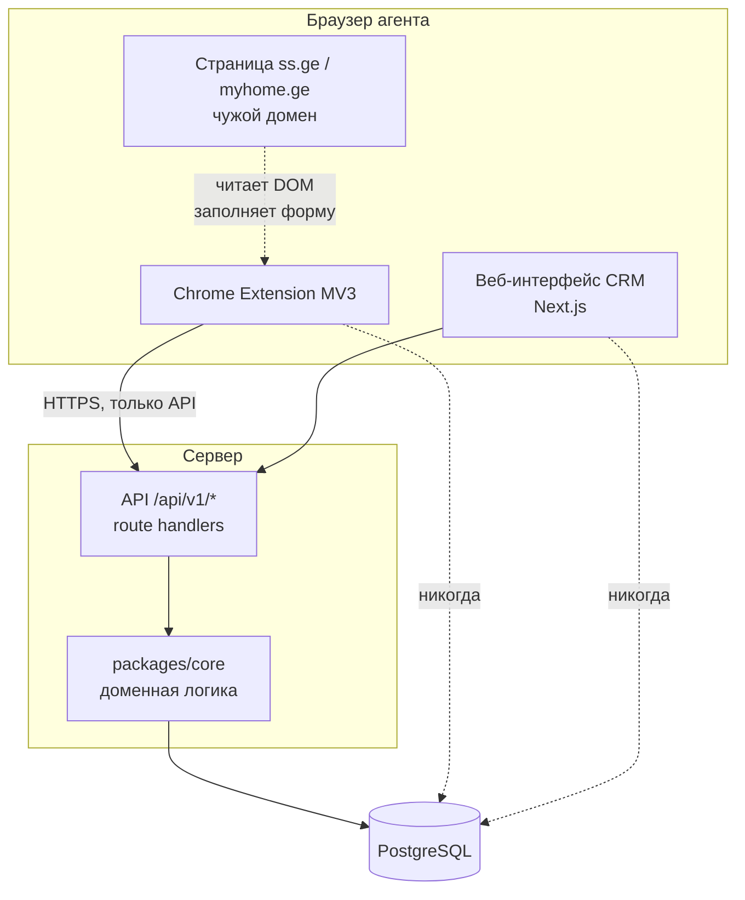
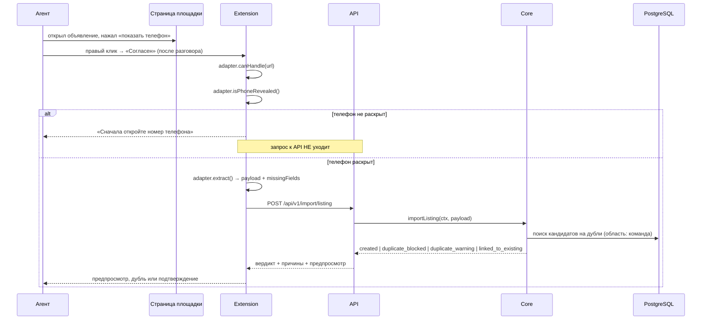
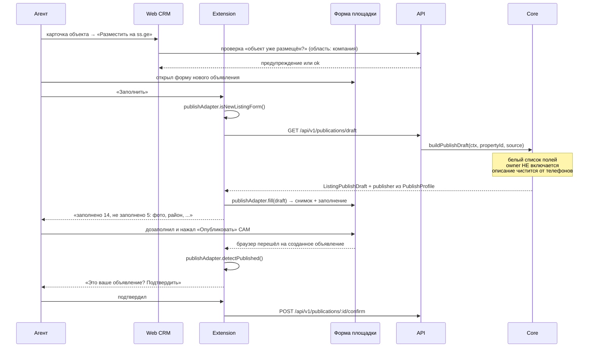

# Системная архитектура

**Дата:** 2026-08-31. **Фаза:** 1. **Основание:** промпт v2.2 разделы 4, 6, 6А, 6В; `ADR-0001-stack.md`.

---

## 1. Модули и границы



Пунктирные стрелки «никогда» — инвариант 2. Ни расширение, ни браузерный код веба не имеют доступа к базе. Единственный путь к данным — `/api/v1/*`.

| Модуль | Где живёт | За что отвечает | Чего не делает |
|---|---|---|---|
| **Extension** | `apps/extension` | Чтение открытой агентом страницы, заполнение формы размещения, четыре действия по результату разговора | Не решает, дубль ли это. Не собирает черновик публикации. Не отправляет формы |
| **Web App** | `apps/web` (клиент) | Списки, карточки, канбан, дашборд, настройки, мастер миграции | Не проверяет права всерьёз — только прячет кнопки (правило 6) |
| **API** | `apps/web/app/api/v1` | Разбор запроса, аутентификация, отображение ошибок в HTTP | Не содержит бизнес-логики (ADR-0001) |
| **Core** | `packages/core` | Дедупликация, нормализация, сценарии, сборка черновика публикации, расчёт выгодности | Не знает про HTTP, куки, Chrome и конкретные площадки |
| **Adapters** | `packages/adapters` | Всё, что знает про ss.ge и myhome.ge | Не обращается к API. Не решает, что делать с извлечённым |
| **DB** | PostgreSQL | Хранение | — |

**Инвариант 6 обеспечен направлением зависимостей, а не соглашением.** `packages/core` не импортирует `packages/adapters`. Это проверяется линтером границ, и попытка импорта роняет CI.

---

## 2. Где именно живут жёсткие правила

Правило, которое держится на внимательности разработчика, — не правило. Ниже для каждого инварианта указано место, где он обеспечен структурно.

| Правило | Обеспечено | Как проверяется |
|---|---|---|
| 5. `companyId` только из контекста | Сценарий `core` принимает `AuthContext` аргументом и не имеет доступа к `request` | Негативный тест на каждом endpoint: чужой `companyId` в теле игнорируется |
| 6. Права на сервере | Проверка прав — первая строка каждого сценария, до чтения данных | Тест вызывает сценарий с ролью `AGENT` напрямую, минуя UI |
| 11. Раскрытый телефон | `isPhoneRevealed()` в интерфейсе `ListingSourceAdapter`, а не внутри реализации | Тест на фикстуре без раскрытого номера: запрос к API не уходит |
| 12. Публикует человек | В `ListingPublishAdapter` нет метода отправки. Метода `submit` не существует | Тест: в собранном коде расширения нет вызовов `form.submit()` и клика по кнопкам submit |
| 13. Контакты собственника не уходят на площадку | Тип `ListingPublishDraft` не содержит блока `owner`; черновик собирается на сервере по белому списку | Тест: черновик не содержит номер собственника ни в одной нормализации и не содержит имя |
| 16. Индекс общий | `ListingObservation` — единственная таблица без `companyId` | Отдельный негативный тест: `ObservationState` одной компании не виден другой |
| 17. Состояние работы не покидает компанию | `ObservationState` привязан к `teamId` + `companyId` | То же |

---

## 3. Поток импорта: от объявления до объекта

Главный цикл продукта. Между извлечением данных и созданием объекта стоит телефонный разговор — это и есть смысловая правка версии 2.2.



**Четыре исхода вместо трёх.** `linked_to_existing` добавлен по Q23: без него расширение не отличит «этот объект у тебя уже есть» от «объявление с myhome привязано к твоему объекту, найденному на ss». Для агента это разные сообщения — второе означает, что работа выполнена.

**Три остальных действия меню** — «Отказ», «Недозвон», «Перезвонить через N дней» — идут коротким путём: `POST /api/v1/observations/state`. Ни `Property`, ни `OwnerContact` при этом не создаётся (J4, R14), дедупликация не запускается (J5). Телефон при этом сохраняется в индексе, чтобы объявление не всплыло в ленте повторно и второй агент команды не позвонил тому же собственнику (J6).

---

## 4. Поток публикации: от объекта до заполненной формы

Зеркальный сценарий. Ключевое отличие от импорта: **последний шаг делает человек, и система об этом шаге узнаёт только по подтверждению.**



**Что происходит, если агент не подтвердил.** Запись `Publication` остаётся в статусе `filled`, `externalId` нет. Это оставляет дыру в защите от самоимпорта ровно в том случае, когда защита нужна: объявление реально живёт на площадке (C-19). Поэтому проверка самоимпорта не опирается на один ключ — подробности в `duplicate-detection.md`, §6.

**Статус воронки меняется на шаге заполнения, а не подтверждения** (J13). Расширение не знает и не имеет права узнавать, нажал ли агент «Опубликовать».

---

## 5. Интерфейсы адаптеров

Две независимые способности источника. Источник может уметь читать и не уметь заполнять — они версионируются отдельно и ломаются отдельно (инвариант 6, I9).

### Чтение

```ts
interface ListingSourceAdapter {
  readonly sourceId: string;
  readonly parserVersion: string;

  canHandle(url: string): boolean;
  isPhoneRevealed(): boolean;
  extract(): Promise<ExtractionResult>;
}

type ExtractionResult = {
  payload: ListingImportPayload;
  missingFields: string[];
};
```

`isPhoneRevealed()` вынесен в интерфейс намеренно: так требование 6.2 нельзя потерять при добавлении третьего источника. Реализация, которая всегда возвращает `true`, — это провал ревью, а не деталь.

### Заполнение формы

```ts
interface ListingPublishAdapter {
  readonly sourceId: string;
  readonly formVersion: string;

  canHandleForm(url: string): boolean;
  isNewListingForm(): boolean;
  fill(draft: ListingPublishDraft): Promise<FillResult>;
  clear(): Promise<void>;
  detectPublished(): PublishedRef | null;
}

type FillResult = {
  snapshotId: string;
  filled: string[];
  unfilled: Array<{
    field: string;
    reason: 'no_value' | 'no_mapping' | 'field_not_found' | 'manual_only';
  }>;
};
```

**Метода отправки формы в интерфейсе нет и не будет.** Это правило R11, выраженное типом: чтобы нарушить его, придётся дописать метод, а не забыть проверку.

`isNewListingForm()` отделяет форму создания от формы редактирования. Без него «Заполнить» затрёт данные в открытом на редактирование чужом объявлении.

**Словари соответствий** (тип недвижимости CRM → значение площадки, валюта, состояние, отопление) живут в конфиге адаптера, версионируются вместе с `formVersion` и составляются **только по реальным фикстурам** (правило R2). До фикстур в них нет ни одного значения — иначе получится адаптер, который выглядит рабочим и молча ставит неверные значения (R-23).

---

## 6. Расширение изнутри

```
apps/extension/
├── core/
│   ├── auth/           вход, хранение и обновление токена
│   ├── api-client/     единственная точка обращения к серверу
│   ├── storage/        chrome.storage; ничего чувствительного в localStorage
│   ├── import-manager/ определить сайт → извлечь → проверить → отправить
│   └── publish-manager/ узнать форму → получить черновик → заполнить → отчитаться
└── ui/
    ├── popup/
    ├── page-button/
    ├── context-menu/
    ├── preview/  duplicate/  error/
    └── fill-result/  clear-form/
```

`publish-manager` появляется **в фазе 6Б**. До неё его нет даже пустым файлом — правило R5 против заглушек.

**Состояние в памяти service worker не хранится.** MV3 усыпляет воркер без предупреждения (R-09), и состояние импорта пропадёт посреди работы агента. Всё, что должно пережить сон, лежит в `chrome.storage`. Данные предпросмотра переживают сетевую ошибку и повтор (D15).

**Запросы к API идут из service worker, а не из content script.** Content script выполняется в контексте чужой страницы; токен там держать нельзя.

---

## 7. Сбор индекса

Фаза 9. Заложен здесь, потому что меняет техническую конструкцию продукта и это надо понимать заранее (R-28).

**Пассивный сбор через расширения агентов** (Q35, K6). Агент и так весь день листает две площадки; расширение фиксирует то, что попалось ему на глаза, и отправляет в индекс.

Почему не серверный обход: трафик неотличим от человеческого, потому что он и есть человеческий; не нужна инфраструктура прокси; покрытие растёт вместе с клиентской базой. Минус честный — при первых клиентах покрытие бедное, и лента сначала работает плохо.

**Серверного обхода площадок в MVP нет.** Именно этой формулировкой закрыт C-02. Если он понадобится — отдельное решение и отдельный ADR.

**Ни строки сборщика до фикстур** (K7). Сколько данных отдаёт страница результатов поиска без открытия карточки — неизвестно. Страницы результатов обеих площадок входят в пакет фикстур фазы 5.

---

## 8. Наблюдаемость

| Что | Куда | Ограничение |
|---|---|---|
| Ошибка парсинга | `POST /api/v1/telemetry/parse-failure` → таблица | **Без персональных данных** (D14). Источник, `parserVersion`, URL, код ошибки — и всё |
| `parser failure rate` | Дашборд фазы 8 | О смене вёрстки узнаём из метрики, а не от разозлённого агента (R-02) |
| `fill failure rate` | Дашборд фазы 8 | То же для формы размещения (R-23) |
| Доля импортов с непустым `missingFields` | Дашборд | Прямо отражает главную гипотезу продукта (R-12) |
| Согласий на агента в день | Дашборд | Главная продуктовая метрика (J24) |
| Медианный интервал «открыл объявление → Согласен» | Дашборд директора | Управленческая метрика против формального нажатия кнопки (R-29) |

Событие об ошибке уходит **обычным POST и пишется в таблицу синхронно**. Очереди здесь нет и не появится — инвариант 10, зафиксировано в C-13, чтобы позже из этого не выросла очередь «просто для надёжности».

---

## 9. Чего в архитектуре нет намеренно

- **Микросервисов, очередей, кэшей** — инвариант 10, пока нет доказанной необходимости.
- **Фоновых заданий по расписанию** — правило R11 и R16. Индекс не звонит и не создаёт объектов; статус публикации меняет человек (Q32).
- **Серверного скрапинга** — C-02.
- **Своего хранилища фотографий** — Q11, только URL. Последствие честно записано в R-07.
